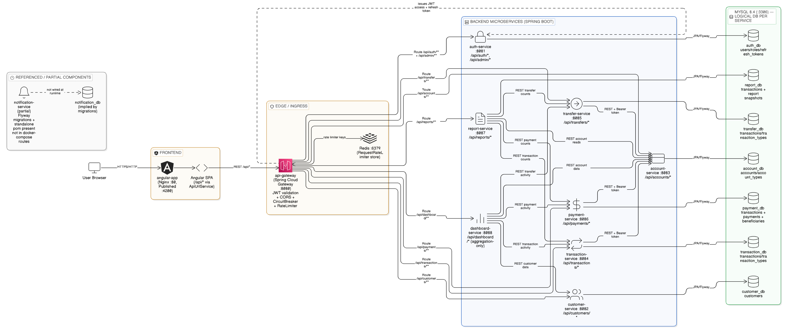

# Financial Platform

A microservices-based financial operations platform built with Spring Boot and Angular. The repository contains a gateway-first backend, a modular frontend SPA, per-service MySQL schemas with Flyway migrations, containerized local deployment, and service-level test suites.

## Architecture Diagram



## Project Overview

This project implements a banking-style operations platform with domains for:

- Authentication and admin user/config APIs.
- Customer onboarding and profile records.
- Account management and balance updates.
- Transaction, transfer, and payment processing.
- Reporting and dashboard aggregation views.

The runtime architecture is:

- **Angular frontend** (served by NGINX in Docker) calls `/api/*`.
- **API Gateway** (Spring Cloud Gateway, port `8080`) validates JWTs, applies rate limiting via Redis, applies circuit breaker fallback, and routes traffic to backend services.
- **Domain microservices** (Spring Boot) each expose APIs and (except dashboard) own a dedicated MySQL schema with Flyway migrations.
- **Redis** backs gateway request rate limiting.
- **MySQL 8.4** stores service data with logical DB-per-service separation.

## Implemented Features

### Backend

- JWT-based auth flow: register/login/refresh/logout, plus admin endpoints for users/configs (`auth-service`).
- CRUD-style customer APIs (`customer-service`).
- Account creation, retrieval, customer account listing, and balance update (`account-service`).
- Transaction APIs including transfer-style posting (`transaction-service`).
- Transfer APIs with validation and status updates (`transfer-service`).
- Payment APIs including beneficiary management and payment status updates (`payment-service`).
- Reporting APIs: report list/summary plus transaction history support (`report-service`).
- Aggregated dashboard API composing customer/account/activity data (`dashboard-service`).
- Central gateway routing with Redis rate limiter and fallback endpoint (`api-gateway`).
- Flyway-managed schema + seed migrations across data-owning services.

### Frontend

- Angular 17 SPA with feature modules/routes for:
  - auth, dashboard, customers, accounts, transactions, transfers, payments, reports, admin.
- JWT-aware HTTP interceptor with refresh-on-401 logic.
- Route guards for authenticated/guest and role-based navigation.
- Shared UX building blocks (spinner, modal, masking pipe, role directive).
- Environment-based config (`development`, `staging`, `production`, `test`).

## Architecture Summary (Service Responsibilities)

| Service | Port | Main Responsibility | Main API Prefix |
|---|---:|---|---|
| api-gateway | 8080 | Edge routing, JWT validation, Redis rate limiting, circuit breaker fallback | `/api/*` routes |
| auth-service | 8081 | Authentication, refresh tokens, admin endpoints | `/api/auth`, `/api/admin` |
| customer-service | 8082 | Customer profile and lifecycle data | `/api/customers` |
| account-service | 8083 | Accounts, account types, balances | `/api/accounts` |
| transaction-service | 8084 | Transaction records + account-linked operations | `/api/transactions` |
| transfer-service | 8085 | Transfer-specific transaction flows + validation/status | `/api/transfers` |
| payment-service | 8086 | Beneficiaries and payment operations | `/api/payments` |
| report-service | 8087 | Report listing, summaries, and report snapshots | `/api/reports` |
| dashboard-service | 8088 | Aggregated operational dashboard view | `/api/dashboard` |

### Inter-service integration pattern

Services integrate primarily via **synchronous REST calls** using `RestTemplate` clients (e.g., account lookups/balance updates from transaction/payment/transfer services, and aggregation calls from dashboard/report).

## Repository Structure

```text
.
├── backend/
│   ├── api-gateway/
│   ├── auth-service/
│   ├── customer-service/
│   ├── account-service/
│   ├── transaction-service/
│   ├── transfer-service/
│   ├── payment-service/
│   ├── report-service/
│   ├── dashboard-service/
│   └── notification-service/      # migration SQL only (partial)
├── frontend/
│   └── angular-app/
├── infra/
│   └── db/init/                   # MySQL bootstrap SQL
├── docs/
│   ├── api-examples.md
│   └── frontend-architecture.md
├── docker-compose.yml
├── start-all.sh
├── DATABASE_SEEDING_GUIDE.md
└── architecture-diagram.png
```

## Technology Stack

### Backend

- Java (project `pom.xml` values use Java **25**, with some Docker images using Temurin **26**).
- Spring Boot 3.5.12.
- Spring Security + JWT (`jjwt`).
- Spring Data JPA (MySQL).
- Flyway (`flyway-core`, `flyway-mysql`).
- Spring Cloud Gateway + Resilience4j (gateway).
- Redis (rate limiter backing store).
- Springdoc OpenAPI UI in service dependencies.

### Frontend

- Angular 17.
- TypeScript 5.4.
- RxJS 7.
- Jest (`jest-preset-angular`) and Karma config present.

### Infrastructure / Tooling

- Docker + Docker Compose.
- NGINX for frontend static hosting and `/api` reverse proxy.
- Maven for backend build/test.
- JaCoCo configured in backend Maven builds with coverage checks.

## Prerequisites

For local (non-Docker) execution:

- JDK compatible with project setup (POM targets Java 25; Dockerfiles mostly use JDK/JRE 26).
- Maven 3.9+.
- Node.js >= 18 and npm >= 9 (from frontend `engines`).
- MySQL 8.x.
- Redis 7.x (required by gateway rate limiter).

For containerized execution:

- Docker Engine + Docker Compose.

## Setup & Installation

### 1) Clone

```bash
git clone <your-repo-url>
cd financial-platform
```

### 2) Configure environment (optional overrides)

You can override defaults via environment variables, for example:

- `MYSQL_ROOT_PASSWORD`
- `SPRING_DATASOURCE_USERNAME`
- `SPRING_DATASOURCE_PASSWORD`
- `APP_JWT_SECRET`
- `*_SERVICE_PORT`, `API_GATEWAY_PORT`, `FRONTEND_PORT`, `REDIS_PORT`

If you do nothing, sensible dev defaults in `docker-compose.yml` are used.

### 3) Database bootstrap

- `docker-compose.yml` mounts `infra/db/init` into MySQL initialization.
- Services then apply their own Flyway migrations on startup.

## Running the Project

### Option A — Full stack with Docker Compose (recommended)

```bash
docker compose up --build
```

Then access:

- Frontend: `http://localhost:4200`
- API Gateway: `http://localhost:8080`

### Option B — Scripted local start

A helper script exists:

```bash
./start-all.sh
# or environment-specific frontend build first:
./start-all.sh dev
./start-all.sh staging
```

What it does:

- Builds each backend service using Maven (`clean install -DskipTests`).
- Starts each backend JAR in background and writes logs under `./logs`.
- Runs frontend build for matching environment if script exists, then `npm start`.

## Configuration

### Backend

- Each service has `src/main/resources/application.yml` with:
  - `server.port`
  - datasource settings (where applicable)
  - JWT secret key
  - service-to-service base URLs (for dependent services)
  - actuator exposure
- Flyway is enabled with `baseline-on-migrate: true` in data-owning services.

### Gateway

- Route definitions map `/api/<domain>/**` to each service URL.
- Global CORS config allows broad origin/method/header usage.
- Default filters include:
  - Redis-backed request rate limiter.
  - Circuit breaker with `/fallback`.

### Frontend

- Environment files define `apiBaseUrl`, request timeout, and session idle timeout.
- Dev server proxy (`proxy.conf.json`) forwards `/api` to `http://localhost:8080`.
- Docker NGINX uses `API_UPSTREAM` (default `http://api-gateway:8080`) to proxy `/api`.

## API & Service Overview

High-value endpoint groups discovered from controllers:

- Auth/Admin: `/api/auth/*`, `/api/admin/*`
- Customers: `/api/customers`
- Accounts: `/api/accounts`
- Transactions: `/api/transactions`
- Transfers: `/api/transfers`
- Payments: `/api/payments`
- Reports: `/api/reports`
- Dashboard: `/api/dashboard`

A quick request set is also available in `docs/api-examples.md`.

## Database & Migrations

### Database topology

- Logical schema per major service:
  - `auth_db`, `customer_db`, `account_db`, `transaction_db`, `transfer_db`, `payment_db`, `report_db`.

### Migration approach

- Flyway migrations are in each service under:
  - `src/main/resources/db/migration/`
- Migration naming convention follows `V<version>__<description>.sql`.
- Includes schema creation/hardening/index updates/seed data.

### Notes

- `infra/db/init/*.sql` bootstraps initial schemas/tables for selected domains.
- Service startup Flyway migrations remain the authoritative evolving schema mechanism.

## Testing

### Backend

Each backend service contains JUnit/Mockito-based tests under `src/test/java`.
Typical commands:

```bash
cd backend/<service-name>
mvn test
```

JaCoCo is configured in Maven for report + threshold checks during `verify`.

### Frontend

In `frontend/angular-app`:

```bash
npm test
npm run test:coverage
```

Jest is the primary configured runner in `package.json`; Karma configuration also exists.

## Scripts & Automation

- `start-all.sh` — local orchestrator for building/running all backend services plus frontend.
- `docker-compose.yml` — full container orchestration (DB, Redis, gateway, services, frontend).
- Per-service `Dockerfile` — multi-stage builds for Java services and Angular+NGINX frontend image.

## Current Status / Known Gaps

- `backend/notification-service/` contains Flyway migration SQL only (no runnable Spring Boot service code currently).
- A separate top-level `notification-service/pom.xml` exists, but no matching source tree under that directory.
- `docker-compose.yml` does **not** include a notification-service container.
- Java version signals are mixed across files (POM properties `25`, most Dockerfiles using Temurin `26`, dashboard Dockerfile using `25`).

## Contributing

1. Create a feature branch.
2. Keep changes scoped to a service/module where possible.
3. Run relevant backend/frontend tests locally.
4. Submit a PR with a clear summary and impacted services.

## License

No license file is currently present in this repository.

## Contact / Ownership

No explicit maintainer or contact metadata is defined in repository root files.
"# financial-app" 
